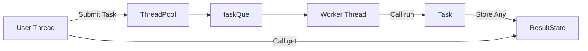

# C++17 ThreadPool

[中文文档](README.zh-CN.md)

A lightweight thread pool project for learning C++ multithreaded programming.

This project implements a fixed-size thread pool. It supports submitting regular functions, lambdas, and function objects, while also keeping the traditional `Task` inheritance-based submission style. After a task finishes, the caller can retrieve its return value through `Result::get()`.

## Features

- Implemented with C++17
- Fixed number of worker threads
- Configurable task queue capacity
- Supports lambdas, regular functions, and function objects
- Supports retrieving task return values through `Result`
- Supports task exception propagation
- Safely notifies worker threads to exit when the thread pool is destroyed
- Uses `mutex` and `condition_variable` for thread synchronization
- Uses a custom `Any` type to store task return values of different types

## Project Structure

```text
cpp_thread_pool/
+-- include/
|   +-- threadpool.h
+-- test/
|   +-- test.cpp
+-- README.md
+-- README.zh-CN.md
+-- LICENSE
```

## Requirements

A compiler with C++17 support is required, for example:

- GCC 7+
- Clang 5+
- MSVC 2017+

## Quick Start

### 1. Submit a Lambda Task

```cpp
#include "threadpool.h"

#include <iostream>

int main() {
  ThreadPool pool;
  pool.start(4);

  auto result = pool.submit([] {
    return 40 + 2;
  });

  int value = result.get().cast_<int>();
  std::cout << value << std::endl;

  return 0;
}
```

Output:

```text
42
```

### 2. Submit a Task with Arguments

```cpp
auto result = pool.submit([](int a, int b) {
  return a + b;
}, 10, 20);

int sum = result.get().cast_<int>();
```

### 3. Submit a Regular Function

```cpp
int add(int a, int b) {
  return a + b;
}

auto result = pool.submit(add, 3, 4);
int value = result.get().cast_<int>();
```

### 4. Submit a Task with No Return Value

```cpp
auto result = pool.submit([] {
  // do something
});

result.get();  // Wait until the task finishes.
```

### 5. Use the Traditional Task Inheritance Style

```cpp
#include "threadpool.h"

#include <iostream>
#include <memory>

class AddTask : public Task {
 public:
  Any run() override {
    return 40 + 2;
  }
};

int main() {
  ThreadPool pool;
  pool.start(2);

  auto result = pool.submitTask(std::make_shared<AddTask>());
  int value = result.get().cast_<int>();

  std::cout << value << std::endl;
  return 0;
}
```

## Core Design

The core workflow of the thread pool is shown below:



### ThreadPool

`ThreadPool` is the main class of the thread pool. It is responsible for:

- Creating and managing worker threads
- Receiving tasks submitted by users
- Maintaining the task queue
- Notifying worker threads to exit when the thread pool is destroyed

### Task

`Task` is the abstract base class for user-defined tasks:

```cpp
class Task {
 public:
  virtual ~Task() = default;
  virtual Any run() = 0;
};
```

When using `submitTask()`, users need to inherit from `Task` and override `run()`.

When using the template-based `submit()` interface, the thread pool automatically wraps lambdas, functions, and other callable objects into an internal `FunctionTask`, so users do not need to manually inherit from `Task`.

### Result and ResultState

`Result` is the result handle returned to the caller.

The actual task result is stored in `ResultState`. It is responsible for:

- Storing the task return value
- Storing task exceptions
- Blocking until the task finishes
- Waking up the user thread that is waiting for the result

This design avoids storing a raw `Result*` inside `Task`, which reduces the risk of dangling pointers.

### Any

`Any` is used to store return values of arbitrary types.

For example:

```cpp
auto result = pool.submit([] {
  return std::string("hello");
});

std::string value = result.get().cast_<std::string>();
```

The `Any` type in this project is a learning-oriented implementation of type erasure. C++17 also provides `std::any`, which can be considered in real-world projects.

## Thread Synchronization

The thread pool mainly uses two condition variables:

```cpp
std::condition_variable notFull_;
std::condition_variable notEmpty_;
```

Their meanings are:

- `notEmpty_`: worker threads wait when the task queue is empty; they are woken up when new tasks are submitted
- `notFull_`: task submitters wait when the task queue is full; they are woken up when worker threads take tasks from the queue

The basic worker thread logic is:

```text
Wait until the task queue is not empty
        |
Take one task
        |
Execute task->run()
        |
Write the result into ResultState
        |
Wait for the next task
```

## Exception Handling

If a task throws an exception during execution, the worker thread will not crash directly.

The exception is stored in `ResultState`:

```cpp
try {
  item.result->setValue(item.task->run());
} catch (...) {
  item.result->setException(std::current_exception());
}
```

When the user calls `Result::get()`, the exception is rethrown in the user thread.

## Notes

1. The current version implements a fixed-size thread pool.

2. `ThreadPoolMode::MODE_CACHED` currently does not implement dynamic thread scaling. If this mode is set, the code will throw an exception.

3. `Result::get()` can only be called once. The current `Any` type uses move semantics, so the result is consumed after it is retrieved.

4. `pool.start()` must be called before submitting tasks.

5. When the thread pool is destroyed, it waits for worker threads to exit. If there are still pending tasks in the queue, worker threads will try to finish the remaining tasks first.

## Possible Improvements

- Replace the custom `Result` with `std::future` and `std::packaged_task`
- Replace the custom `Any` with `std::any`
- Implement dynamic scaling for `MODE_CACHED`
- Add timeout support for waiting on tasks
- Add a priority task queue
- Add unit tests


## Learning Topics

This project is suitable for learning:

- C++17 template programming
- Type erasure
- Basic thread pool design
- Producer-consumer model
- `std::thread`
- `std::mutex`
- `std::condition_variable`
- `std::shared_ptr`
- Lifetime management in multithreaded programs
- Exception propagation between threads

## License

MIT License. This project is mainly intended for learning and practice.
