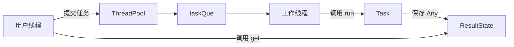

# C++17 ThreadPool

一个用于学习 C++ 多线程编程的简易线程池项目。

这个项目实现了一个固定线程数的线程池，支持提交普通函数、Lambda、函数对象，也保留了继承 `Task` 的传统提交方式。任务执行完成后，用户可以通过 `Result::get()` 获取返回值。

本版把结果传递、线程同步、异常传播全部摊开展示，利于学习线程池底层原理。下一版将改成 std::future + std::packaged_task。

## 项目特点

- 基于 C++17 实现
- 支持固定数量工作线程
- 支持任务队列容量限制
- 支持 Lambda、普通函数、函数对象提交
- 支持通过 `Result` 获取任务返回值
- 支持任务异常传递
- 线程池析构时会安全通知工作线程退出
- 使用 `mutex` 和 `condition_variable` 实现线程同步
- 使用自定义 `Any` 保存不同类型的任务返回值

## 文件结构

```text
cpp_thread_pool/
├── include/
│   └── threadpool.h
├── test/
│   └── test.cpp
├── README.md
├── README.zh-CN.md
└── LICENSE
```

## 环境要求

需要支持 C++17 的编译器，例如：

- GCC 7+
- Clang 5+
- MSVC 2017+


## 快速开始

### 1. 提交 Lambda 任务

```cpp
#include "threadpool.h"

#include <iostream>

int main() {
  ThreadPool pool;
  pool.start(4);

  auto result = pool.submit([] {
    return 40 + 2;
  });

  int value = result.get().cast_<int>();
  std::cout << value << std::endl;

  return 0;
}
```

输出：

```text
42
```

### 2. 提交带参数的任务

```cpp
auto result = pool.submit([](int a, int b) {
  return a + b;
}, 10, 20);

int sum = result.get().cast_<int>();
```

### 3. 提交普通函数

```cpp
int add(int a, int b) {
  return a + b;
}

auto result = pool.submit(add, 3, 4);
int value = result.get().cast_<int>();
```

### 4. 提交无返回值任务

```cpp
auto result = pool.submit([] {
  // do something
});

result.get();  // 等待任务执行完成
```

### 5. 使用继承 Task 的传统方式

```cpp
#include "threadpool.h"

#include <iostream>
#include <memory>

class AddTask : public Task {
 public:
  Any run() override {
    return 40 + 2;
  }
};

int main() {
  ThreadPool pool;
  pool.start(2);

  auto result = pool.submitTask(std::make_shared<AddTask>());
  int value = result.get().cast_<int>();

  std::cout << value << std::endl;
  return 0;
}
```

## 核心设计

线程池的核心流程如下：



### ThreadPool

`ThreadPool` 是线程池主体，负责：

- 创建和管理工作线程
- 接收用户提交的任务
- 维护任务队列
- 在线程池析构时通知工作线程退出

### Task

`Task` 是任务抽象基类：

```cpp
class Task {
 public:
  virtual ~Task() = default;
  virtual Any run() = 0;
};
```

如果使用 `submitTask()`，用户需要继承 `Task` 并重写 `run()`。

如果使用模板 `submit()`，线程池会自动把 Lambda、函数等包装成内部的 `FunctionTask`，用户不需要手动继承 `Task`。

### Result 和 ResultState

`Result` 是用户拿到的结果句柄。

真正保存任务结果的是 `ResultState`。它负责：

- 保存任务返回值
- 保存任务异常
- 阻塞等待任务完成
- 唤醒等待结果的用户线程

这样可以避免让 `Task` 保存 `Result*` 裸指针，从而减少悬空指针风险。

### Any

`Any` 用来保存任意类型的返回值。

例如：

```cpp
auto result = pool.submit([] {
  return std::string("hello");
});

std::string value = result.get().cast_<std::string>();
```

这个项目里的 `Any` 是一个学习版类型擦除实现。C++17 标准库中也提供了 `std::any`，实际工程中可以考虑使用标准库方案。

## 线程同步逻辑

线程池中主要使用两个条件变量：

```cpp
std::condition_variable notFull_;
std::condition_variable notEmpty_;
```

含义如下：

- `notEmpty_`：任务队列为空时，工作线程等待；有任务提交后唤醒工作线程
- `notFull_`：任务队列满时，提交任务的线程等待；工作线程取走任务后唤醒提交线程

工作线程的基本逻辑：

```text
等待任务队列非空
        ↓
取出一个任务
        ↓
执行 task->run()
        ↓
把结果写入 ResultState
        ↓
继续等待下一个任务
```

## 异常处理

如果任务执行过程中抛出异常，工作线程不会直接崩溃。

异常会被保存到 `ResultState` 中：

```cpp
try {
  item.result->setValue(item.task->run());
} catch (...) {
  item.result->setException(std::current_exception());
}
```

用户调用 `Result::get()` 时，异常会在用户线程中重新抛出。

## 注意事项

1. 当前版本实现的是固定线程数线程池。

2. `ThreadPoolMode::MODE_CACHED` 目前没有实现动态扩容逻辑。如果设置该模式，代码会抛出异常。

3. `Result::get()` 只能调用一次。因为当前 `Any` 是移动语义，结果被取出后就被消费了。

4. 任务提交前必须先调用 `pool.start()`。

5. 线程池析构时会等待工作线程退出。如果队列中还有未执行任务，工作线程会先尽量处理完剩余任务。

## 后续可改进方向

- 使用 `std::future` 和 `std::packaged_task` 替代自定义 `Result`
- 使用 `std::any` 替代自定义 `Any`
- 实现 `MODE_CACHED` 动态扩容模式
- 增加任务超时等待
- 增加优先级任务队列
- 增加单元测试

## 适合学习的知识点

这个项目适合用来学习：

- C++17 模板编程
- 类型擦除
- 线程池基本原理
- 生产者消费者模型
- `std::thread`
- `std::mutex`
- `std::condition_variable`
- `std::shared_ptr`
- 多线程中的生命周期管理
- 异常在线程之间的传递

## License

MIT开源协议。本项目主要用于学习和练习。
