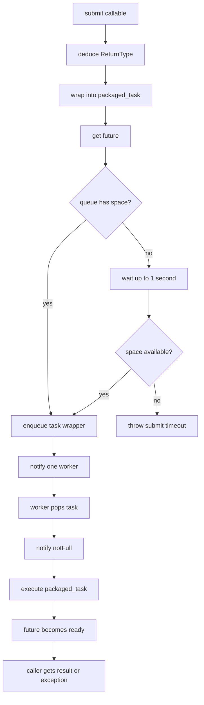
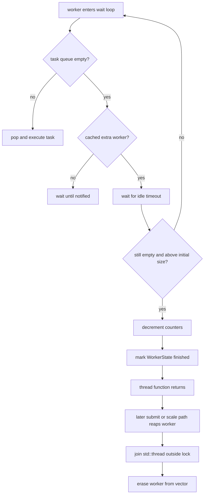
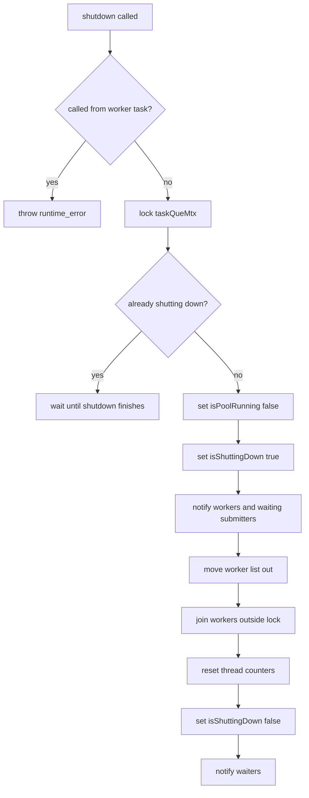

# Thread Pool Lifecycle

这份文档用流程图描述一次任务从提交到完成，以及线程池关闭时的主要路径。

## Task Flow

## Cached Worker Flow

## Shutdown Flow

## Notes

- `submit()` 在等待队列空位时会释放锁，所以醒来后必须重新检查线程池是否仍在运行。
- `shutdown()` 不清空任务队列；已经入队的任务会继续执行。
- `shutdown()` 不允许从线程池任务内部调用。
- `shutdown()` 完成后，同一个线程池对象可以再次 `start()`。
- `join` 不能在持有 `taskQueMtx_` 的状态下执行。
- cached worker 退出时只标记自己结束，真正的 `std::thread` 回收由线程池后续完成。
